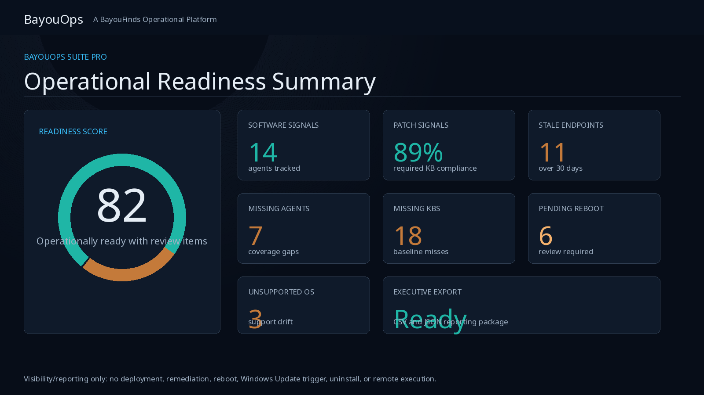
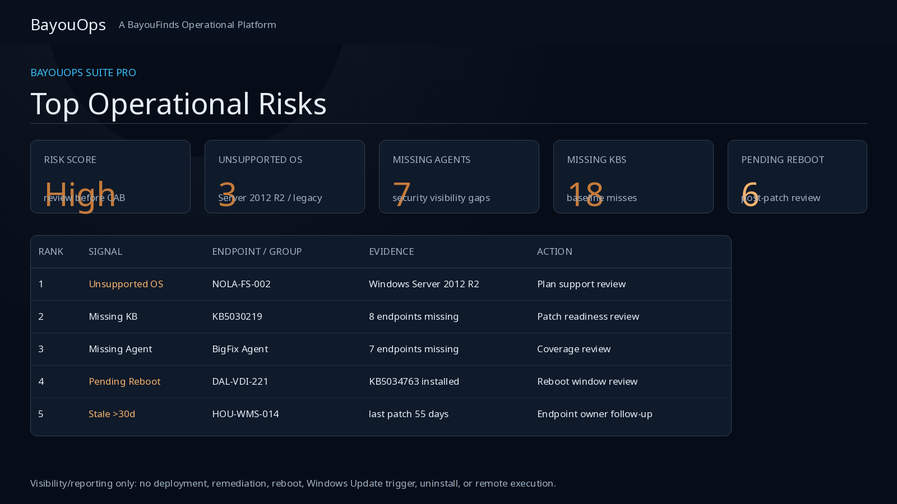
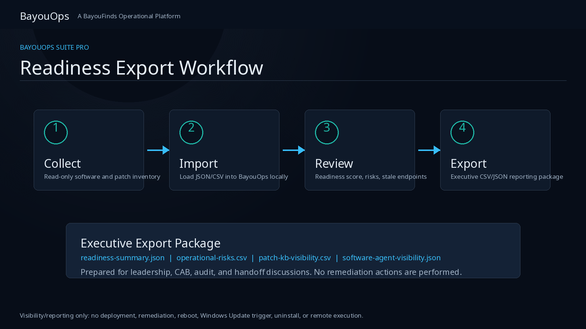
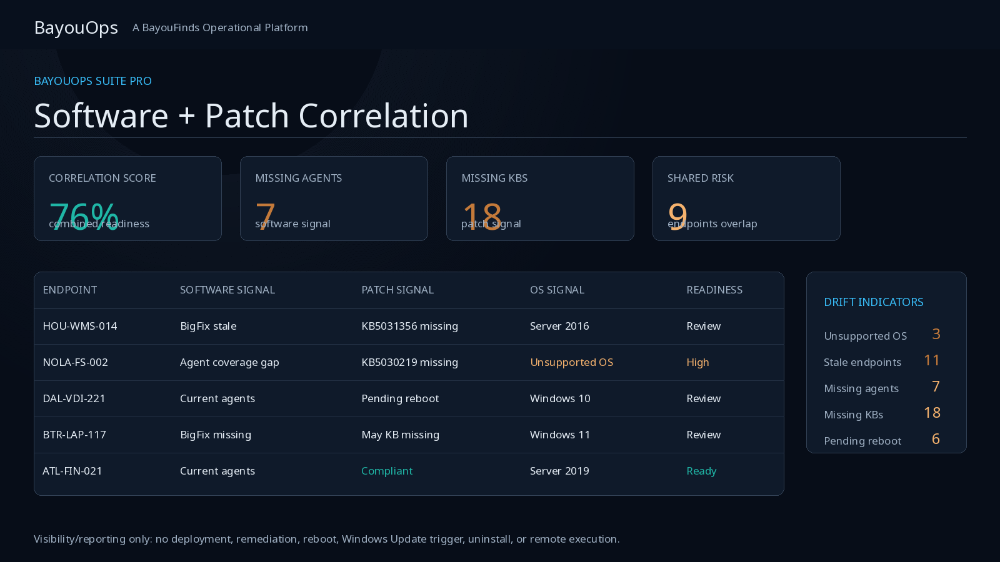
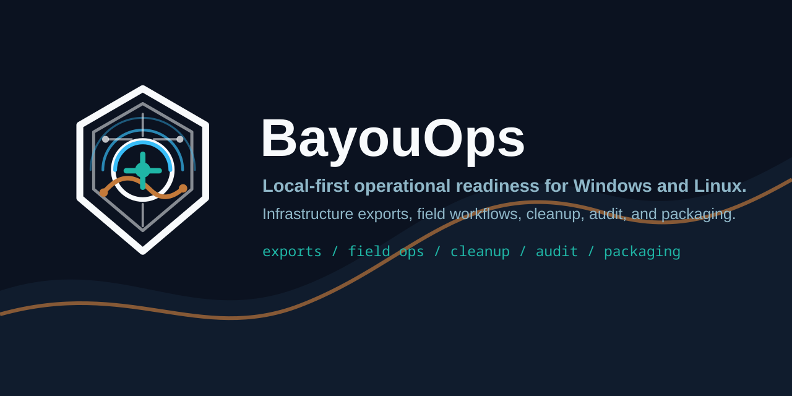
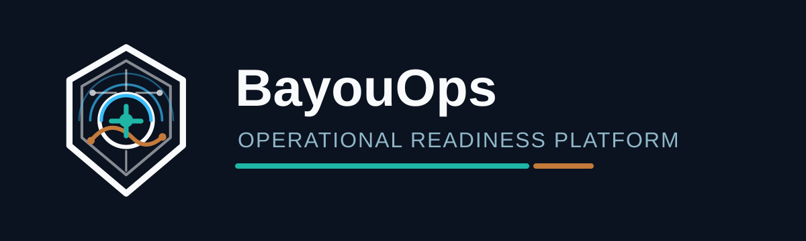

# BayouOps Suite Pro

Lightweight local-first operational visibility, readiness, and export tooling for Windows and Linux environments.

BayouOps Suite Pro focuses on practical operational visibility without requiring enterprise-scale infrastructure, cloud dependency, or subscription-heavy monitoring platforms.

BayouOps is visibility and reporting focused. It is not positioned as an RMM, agent-control platform, deployment orchestrator, remediation system, or remote execution tool.

- Netlify site: https://bayouops-suite-pro.netlify.app
- GitHub repo: https://github.com/dewaynecox123456-lang/bayouops-suite-pro
- Website: https://bayoufinds.com
- Support email: [support@bayoufinds.com](mailto:support@bayoufinds.com)
- Support phone: Coming soon

---

# Latest Demo

The latest operational readiness demo shows BayouOps Suite Pro as a lightweight,
local-first visibility layer for small IT teams that need trustworthy reporting
without turning the product into a remediation or remote-control platform.

Demo workflow coverage:

- Software Visibility
- Patch Readiness
- Endpoint Risk Correlation
- Executive Export Workflow

The homepage includes an embedded local MP4 demo player when the bundled video
asset is available, plus a screenshot gallery from the completed operational
readiness workflow.

BayouOps is:

- visibility/reporting focused
- lightweight
- local-first
- operational readiness oriented

BayouOps is not:

- an RMM
- a patch deployment system
- remote remediation tooling

## Delivery Safety Profile

BayouOps is designed for customer delivery as a local, portable, on-demand
visibility and reporting workflow:

- read-only collectors and local file processing
- no endpoint modifications, deployment, reboot, or remediation actions
- no telemetry, cloud sync, authentication service, or background daemon
- operator-triggered execution only
- generated reports written to local export folders
- low-resource behavior because scripts run only when launched

## Support

For customer support, use [support@bayoufinds.com](mailto:support@bayoufinds.com).
Support phone is `Coming soon` until a dedicated business support number is
ready. Support email forwarding must be verified before public customer launch;
setup guidance is available in
[`docs/SUPPORT_EMAIL_SETUP.md`](docs/SUPPORT_EMAIL_SETUP.md).

## License File

A license file is required for protected workflows. Contact
[support@bayoufinds.com](mailto:support@bayoufinds.com) if you need a license
file.

BayouFinds issues customer `license.json` files manually. Customers place the
file at `config/license.json`. License validation is designed to remain offline,
local, and transparent; no online activation or telemetry is used.

Seller-side offline license generation is documented in
[`docs/LICENSE_GENERATION.md`](docs/LICENSE_GENERATION.md).

## Screenshot Gallery









## Operational Workflow

BayouOps keeps the workflow intentionally narrow and auditable:

1. Import local software and patch evidence from read-only collectors or sample files.
2. Review software coverage, stale agents, missing agents, version drift, KB compliance, pending reboot state, and unsupported OS indicators.
3. Correlate endpoint-level risk factors into an operational readiness score.
4. Export operator-readable or executive-ready evidence for leadership, CAB, audit, or handoff discussions.

No deployment, reboot, remediation, registry modification, Windows Update
triggering, or remote execution behavior is included.

For customer handoff checks, see
[`docs/CUSTOMER_DELIVERY_CHECKLIST.md`](docs/CUSTOMER_DELIVERY_CHECKLIST.md).

## Lines Of Business Configuration

Customer-facing Lines of Business are configured locally in
[`config/lines-of-business.json`](config/lines-of-business.json).

Operators can edit the `linesOfBusiness` array to rename, add, or remove
department, region, site, or business-unit names without changing code. Demo
generation uses those names when creating new local demo records.

The optional `aliases` object maps older demo or imported names to updated
customer-facing names during dashboard rendering. For example, `"HR": "Human
Resources"` keeps older demo records readable after renaming the LOB.

If the config file is missing, empty, or malformed, BayouOps falls back to safe
default demo LOB names and prints a warning.

## Executive Demo Export

Generate the current local executive dashboard, then package it with the latest
demo dataset into a timestamped local export folder:

```bash
node scripts/demo/render-demo-dashboard.mjs
node scripts/demo/export-executive-demo-pack.mjs
```

Exports are written under `exports/demo/` and include the dashboard HTML, latest
generated demo JSON dataset, `SUMMARY.md`, `metadata.json`, and the local LOB
config when present.

---

# Why BayouOps Exists

Modern operational tooling is often:

- overloaded
- cloud-dependent
- difficult to hand off
- expensive for small teams
- difficult to evaluate quickly

BayouOps Suite Pro was designed to provide:

- local-first workflows
- exportable operational evidence
- lightweight readiness visibility
- software and agent deployment visibility
- operator-readable outputs
- practical operational summaries

---

# Current Developer Preview Features

## Software / Agent Visibility

The product site includes a first-pass Software / Agent Visibility module in the `#software-visibility` section of [`index.html`](index.html).

The module provides read-only operational awareness for questions such as:

- How many systems still have old Dynatrace?
- Which endpoints are stale?
- Which systems have old Cisco Secure Endpoint / AMP?
- Which systems are missing BigFix?
- What version drift exists across endpoint agents?
- Can this data be exported for leadership, CAB, audit, or handoff review?

Supported visibility fields include software name, installed version, current or recommended version, endpoint count, stale endpoint count, missing endpoint count, endpoint hostname, OS, last check-in, deployment notes, install string, uninstall string, and operational status.

Current operational statuses are:

- Current
- Old
- Missing
- Review

The module includes realistic sample data for common enterprise agents such as Dynatrace OneAgent, BigFix Agent, Cisco Secure Endpoint / AMP, FireEye Agent, Entrust, Cisco VPN, CrowdStrike Falcon, SentinelOne, Splunk Universal Forwarder, Zscaler Client Connector, Qualys Cloud Agent, Rapid7 Insight Agent, and Defender for Endpoint.

Export-ready JSON and CSV downloads are available directly from the dashboard for reporting workflows.

Future real endpoint data can come from the read-only Windows Software Inventory
Collector at [`collectors/windows/Get-BayouOpsSoftwareInventory.ps1`](collectors/windows/Get-BayouOpsSoftwareInventory.ps1).
The collector reads Windows uninstall registry metadata and exports JSON or CSV
for BayouOps visibility/reporting workflows. The Software / Agent Visibility
module can import that JSON or CSV, group records by `DisplayName`, show version
drift by `DisplayVersion`, and keep report exports available. It is not a
deployment, uninstall, remediation, remote execution, registry modification, or
agent control tool.

Collector documentation is available at
[`docs/WINDOWS_SOFTWARE_INVENTORY_COLLECTOR.md`](docs/WINDOWS_SOFTWARE_INVENTORY_COLLECTOR.md).

## Patch / KB Visibility

The product site includes a Patch / KB Visibility module for read-only
operational readiness reporting. It supports KB search, missing KB visibility,
pending reboot review, stale endpoint indicators, unsupported OS review, and
CSV/JSON report exports.

Future real patch data can come from the read-only Windows Patch Inventory
Collector at [`collectors/windows/Get-BayouOpsPatchInventory.ps1`](collectors/windows/Get-BayouOpsPatchInventory.ps1).
The collector uses `Get-HotFix` and `Get-CimInstance Win32_QuickFixEngineering`
to export local patch evidence for BayouOps import. It is not a patch deployment,
remediation, reboot, Windows Update trigger, registry modification, or remote
execution tool.

Collector documentation is available at
[`docs/WINDOWS_PATCH_INVENTORY_COLLECTOR.md`](docs/WINDOWS_PATCH_INVENTORY_COLLECTOR.md).

## Windows Operational Readiness Export

Generate a local Windows operational readiness export:

```powershell
pwsh -NoProfile -File .\windows\Export-PatchReadiness.ps1
```

---

# Platform Preview

## BayouOps Brand Banner



## Launcher Icon Concept


## BayouOps Lockup



## Square Icon


---

# Demo Materials

Polished demo scripts, walkthrough notes, buyer-story framing, video planning assets, and launch copy are available in [`videos/2026-05-29/`](videos/2026-05-29/). These materials position BayouOps Suite Pro as an operational readiness and visibility layer for patch, compliance, CAB, and executive reporting workflows.

The current homepage demo player uses the bundled final MP4 at
[`videos/2026-05-29/final/BayouOps_Operational_Readiness_Demo_FINAL_v1.mp4`](videos/2026-05-29/final/BayouOps_Operational_Readiness_Demo_FINAL_v1.mp4).

---

Copyright © 2026 Dewayne Cox and Cheri Cox. All Rights Reserved.
No `videos/2026-05-30/final/` directory is present in this checkout.
