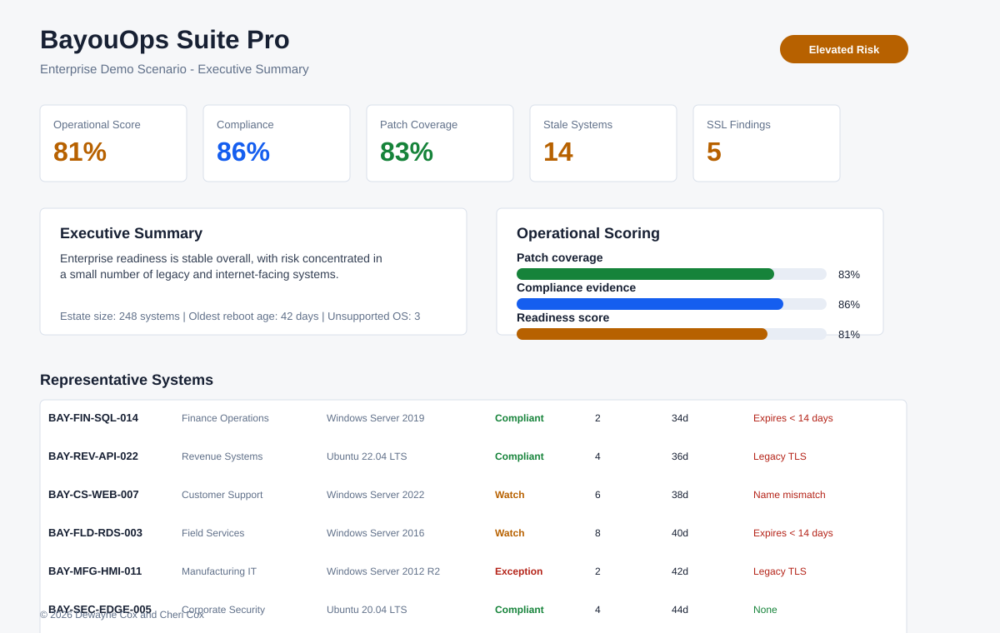
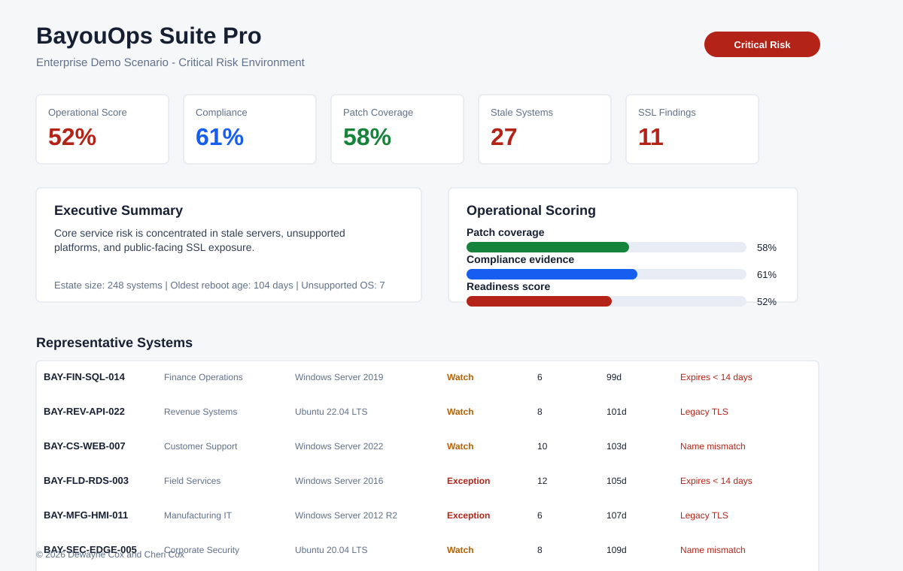
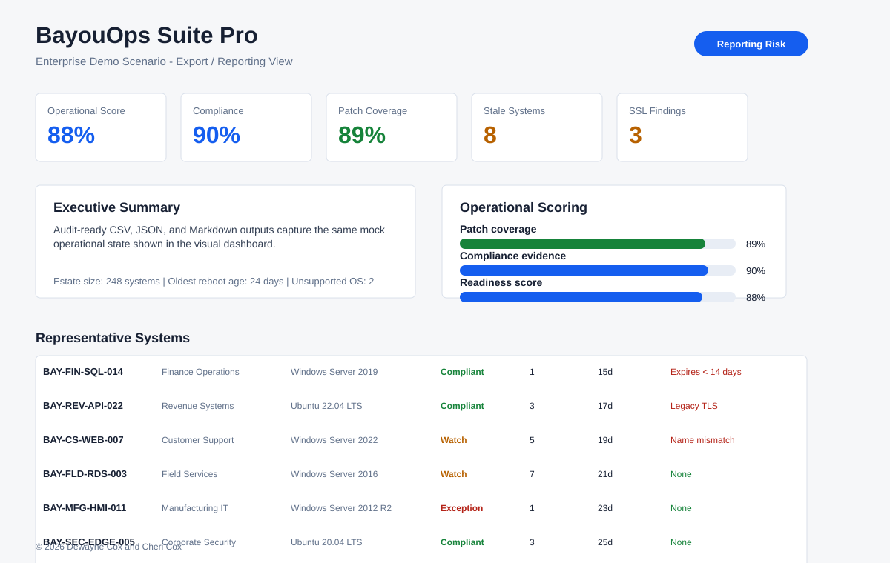

# BayouOps Suite Pro

Operational visibility and readiness tooling designed for infrastructure teams, system administrators, endpoint operations engineers, and compliance-focused environments.

Built from real-world enterprise operational experience managing thousands of Windows systems across workstation and server environments.

> These are the tools we wished we had.

BayouOps Suite Pro was built from real operational experience dealing with:
- patch windows
- stale systems
- compliance pressure
- SSL exposure
- operational drift
- executive reporting requirements
- visibility gaps across infrastructure environments

Built by operations people for operations people.


- Netlify site: https://bayouops-suite-pro.netlify.app
- [Operational Philosophy](docs/PHILOSOPHY.md)
- [Codex Guardrails](docs/CODEX_GUARDRAILS.md)
- GitHub repo: https://github.com/dewaynecox123456-lang/bayouops-suite-pro
- Website: https://bayoufinds.com
- Support email: [support@bayoufinds.com](mailto:support@bayoufinds.com)
- Support phone: Coming soon

---


---

## Operational Focus Areas

* Patch readiness visibility
* Operational risk scoring
* Stale and unsupported system detection
* SSL and certificate exposure visibility
* Executive-ready operational reporting
* Compliance-oriented exports
* Lightweight operational dashboards
* Readiness trend visualization

---

## Enterprise Demo Scenarios

BayouOps Suite Pro includes enterprise-style operational demo environments designed to simulate realistic infrastructure conditions.

### Included Demo States

| Scenario                | Description                                      |
| ----------------------- | ------------------------------------------------ |
| Healthy Environment     | Operationally healthy infrastructure baseline    |
| Medium Risk             | Systems requiring attention but not yet critical |
| Critical Risk           | High-risk operational exposure and stale systems |
| Executive Summary       | Management-focused readiness overview            |
| Export / Reporting View | Operational export and reporting workflow        |
| Before Remediation      | Pre-remediation operational state                |
| After Remediation       | Post-remediation improvement validation          |

---

## Screenshots

### Executive Operational Dashboard



### Operational Risk Visibility



### Executive Reporting Workflow



---

## Project Structure

```text
/docs
/screenshots
/demo-data
/exports
/scripts
/tools
/release
```

---

## Design Goals

BayouOps Suite Pro focuses on operational clarity rather than platform bloat.

The project is intentionally designed to:

* remain lightweight
* stay understandable by small IT teams
* provide operational visibility quickly
* support export/reporting workflows
* improve readiness conversations with leadership and compliance stakeholders

---

## Status

Current phase:

* Early Access / Demo Readiness
* Branding standardization completed
* Enterprise demo-pack workflow implemented
* Release packaging workflow active

---

© 2026 BayouFinds.com — Dewayne Cox & Cheri Cox. All Rights Reserved.


# Latest Demo

The latest BayouOps Suite Pro demo highlights a lightweight, local-first operational visibility platform designed for infrastructure teams that need fast, trustworthy readiness reporting without unnecessary platform complexity.

Current demo coverage includes:

- Operational readiness visibility
- Patch and exposure awareness
- Endpoint risk correlation
- Executive reporting workflows
- Lightweight export and dashboard tooling

# Why BayouOps Exists

Modern operational tooling is often:

- overloaded
- cloud-dependent
- difficult to hand off
- expensive for small teams
- difficult to evaluate quickly

BayouOps Suite Pro was designed to provide:

- local-first workflows
- exportable operational evidence
- lightweight readiness visibility
- software and agent deployment visibility
- operator-readable outputs
- practical operational summaries

---

# Current Developer Preview Features

## Software / Agent Visibility

The product site includes a first-pass Software / Agent Visibility module in the `#software-visibility` section of [`index.html`](index.html).

The module provides read-only operational awareness for questions such as:

- How many systems still have old Dynatrace?
- Which endpoints are stale?
- Which systems have old Cisco Secure Endpoint / AMP?
- Which systems are missing BigFix?
- What version drift exists across endpoint agents?
- Can this data be exported for leadership, CAB, audit, or handoff review?

Supported visibility fields include software name, installed version, current or recommended version, endpoint count, stale endpoint count, missing endpoint count, endpoint hostname, OS, last check-in, deployment notes, install string, uninstall string, and operational status.

Current operational statuses are:

- Current
- Old
- Missing
- Review

The module includes realistic sample data for common enterprise agents such as Dynatrace OneAgent, BigFix Agent, Cisco Secure Endpoint / AMP, FireEye Agent, Entrust, Cisco VPN, CrowdStrike Falcon, SentinelOne, Splunk Universal Forwarder, Zscaler Client Connector, Qualys Cloud Agent, Rapid7 Insight Agent, and Defender for Endpoint.

Export-ready JSON and CSV downloads are available directly from the dashboard for reporting workflows.

Future real endpoint data can come from the read-only Windows Software Inventory
Collector at [`collectors/windows/Get-BayouOpsSoftwareInventory.ps1`](collectors/windows/Get-BayouOpsSoftwareInventory.ps1).
The collector reads Windows uninstall registry metadata and exports JSON or CSV
for BayouOps visibility/reporting workflows. The Software / Agent Visibility
module can import that JSON or CSV, group records by `DisplayName`, show version
drift by `DisplayVersion`, and keep report exports available. It is not a
deployment, uninstall, remediation, remote execution, registry modification, or
agent control tool.

Collector documentation is available at
[`docs/WINDOWS_SOFTWARE_INVENTORY_COLLECTOR.md`](docs/WINDOWS_SOFTWARE_INVENTORY_COLLECTOR.md).

## Patch / KB Visibility

The product site includes a Patch / KB Visibility module for read-only
operational readiness reporting. It supports KB search, missing KB visibility,
pending reboot review, stale endpoint indicators, unsupported OS review, and
CSV/JSON report exports.

Future real patch data can come from the read-only Windows Patch Inventory
Collector at [`collectors/windows/Get-BayouOpsPatchInventory.ps1`](collectors/windows/Get-BayouOpsPatchInventory.ps1).
The collector uses `Get-HotFix` and `Get-CimInstance Win32_QuickFixEngineering`
to export local patch evidence for BayouOps import. It is not a patch deployment,
remediation, reboot, Windows Update trigger, registry modification, or remote
execution tool.

Collector documentation is available at
[`docs/WINDOWS_PATCH_INVENTORY_COLLECTOR.md`](docs/WINDOWS_PATCH_INVENTORY_COLLECTOR.md).

## Windows Operational Readiness Export

Generate a local Windows operational readiness export:

```powershell
pwsh -NoProfile -File .\windows\Export-PatchReadiness.ps1
```

## Maintenance Readiness and Audit Evidence Exports

BayouOps can generate maintenance readiness and audit evidence exports from the
existing patch worklist data. These exports are designed for IT managers,
Windows administrators, CAB reviewers, compliance teams, and SOX/audit
stakeholders who need clear pre-maintenance evidence without turning BayouOps
into an automation or remediation platform.

Generate the exports with:

```bash
node scripts/build-patch-worklist.mjs
```

The command creates the standard patch worklist outputs and these additional
files under [`exports/`](exports/):

- [`exports/maintenance-readiness.csv`](exports/maintenance-readiness.csv) —
  a working evidence register for operator triage. It includes hostname,
  business unit, owner, service, OS, advisory priority, readiness score,
  reboot status, unsupported OS status, recommended patch group, approval state,
  exception status, and review notes.
- [`exports/maintenance-readiness-summary.md`](exports/maintenance-readiness-summary.md) —
  a manager-readable summary for patch weekend preparation. It shows the overall
  readiness posture, owner-review counts, reboot-coordination items, stale
  patch evidence, unsupported OS items, approval-state counts, and the top
  systems that need review before maintenance.
- [`exports/audit-evidence-manifest.json`](exports/audit-evidence-manifest.json) —
  a machine-readable evidence manifest. It records when the evidence was
  generated, which source files were used, which export files were produced,
  summary counts, evidence status counts, approval-state counts, and the
  read-only safety boundaries.

Before patch weekend, an IT manager can use these exports to separate systems
that are ready for scheduling from systems that still need owner review, reboot
coordination, lifecycle exception handling, or stale-evidence validation. The
Markdown summary supports leadership, CAB, and compliance discussions. The CSV
supports operator assignment and follow-up tracking. The JSON manifest supports
audit traceability by documenting the evidence source and generation details.

These exports are advisory only. They do not approve maintenance, deploy
patches, reboot systems, remotely execute commands, modify endpoints, install
agents, or replace human change-control approval.

---

# Platform Preview

## BayouOps Brand Banner


## Launcher Icon Concept


## BayouOps Lockup


## Square Icon


---

# Demo Materials

Polished demo scripts, walkthrough notes, buyer-story framing, video planning assets, and launch copy are available in [`videos/2026-05-29/`](videos/2026-05-29/). These materials position BayouOps Suite Pro as an operational readiness and visibility layer for patch, compliance, CAB, and executive reporting workflows.

The current homepage demo player uses the bundled final MP4 at
[`videos/2026-05-29/final/BayouOps_Operational_Readiness_Demo_FINAL_v1.mp4`](videos/2026-05-29/final/BayouOps_Operational_Readiness_Demo_FINAL_v1.mp4).

---

© 2026 BayouFinds.com — Dewayne Cox & Cheri Cox. All Rights Reserved.
No `videos/2026-05-30/final/` directory is present in this checkout.
