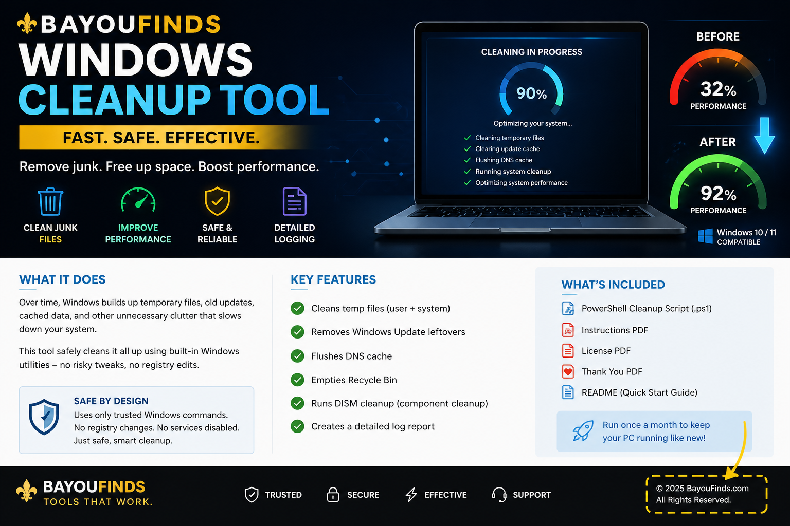
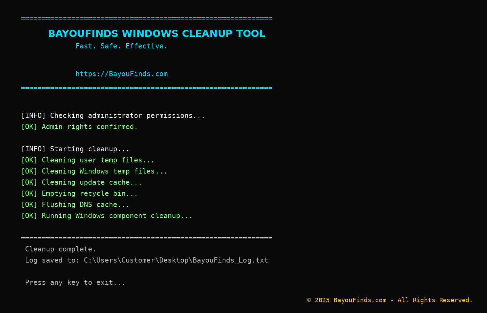
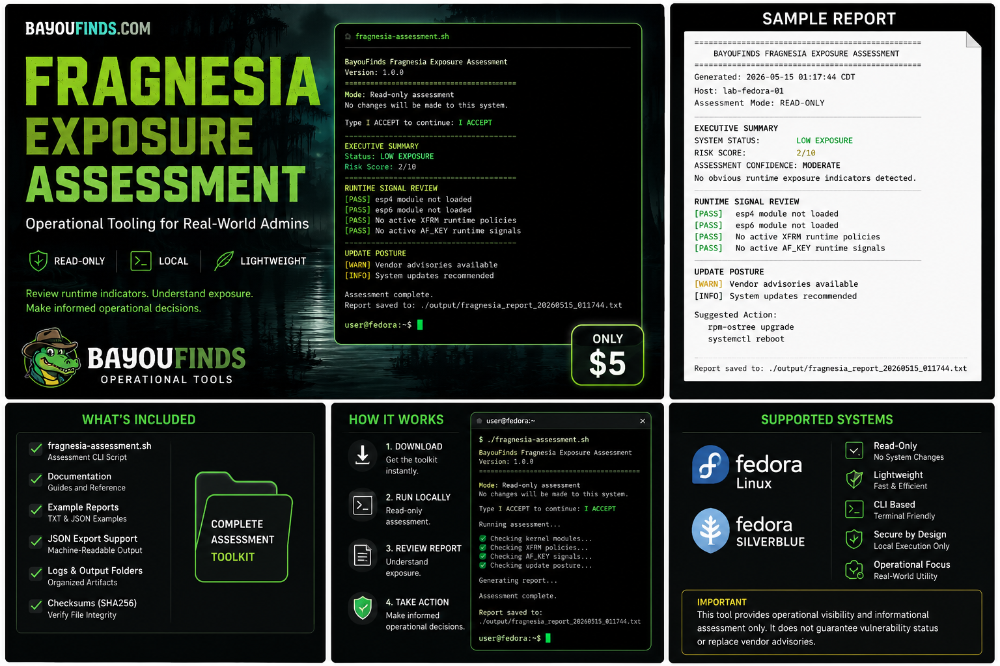

# BayouOps Suite Pro

Lightweight local-first operational readiness and export tooling for Windows and Linux environments.

BayouOps Suite Pro focuses on practical operational visibility without requiring enterprise-scale infrastructure, cloud dependency, or subscription-heavy monitoring platforms.

BayouOps is read-only, operator-controlled, and on demand. It does not modify
endpoints, deploy agents, collect telemetry, phone home, or run hidden
background services.

---

# Why BayouOps Exists

Modern operational tooling is often:

- overloaded
- cloud-dependent
- difficult to hand off
- expensive for small teams
- difficult to evaluate quickly

BayouOps Suite Pro was designed to provide:

- local-first workflows
- exportable operational evidence
- lightweight readiness visibility
- operator-readable outputs
- practical operational summaries

---

# Current Developer Preview Features

## Windows Operational Readiness Export

Generate a local Windows operational readiness export:

```powershell
pwsh -NoProfile -File .\windows\Export-PatchReadiness.ps1
```

Or use the portable launcher:

```powershell
.\BayouOps-Launcher.ps1
```

Generated reports are written to `exports/` inside the portable folder.

---

# Screenshots

## Cleanup Overview



## Terminal Workflow



## Operational Visibility


